<h1>Hi! 👋</h1>
<h3>I'm Ilai, a full-stack web developer.</h4>

I live in Xalapa, Veracruz 🇲🇽. Fluent in Spanish (primary language) and English. I'm available for work.

With over six years of experience in the JavaScript ecosystem, I'm efficient in writing both backend and frontend apps, while also learning new skills and languages like Go and C++ *(sometimes I do some cool low-level stuff)*

I have experience in lots of web technologies, *too many to mention here!*

**📫 Contact:**
* Discord: `@soyilai`
* Telegram [`@soyilai`](https://t.me/soyilai)
* Email: <a href="mailto:soyilai@proton.me">`soyilai@proton.me`</a>
* Portfolio: https://ilai.chimoteam.eu.org

**📑 Latest Blog Posts:**

<!--feedstart--->
<ul><li><a href="https://soyilai.vercel.app/blog/anothertest">Why this?</a></li>Yet another test<li><a href="https://soyilai.vercel.app/blog/test">Testing</a></li>This is a test</ul>
<!--feedend--->

**📊 Stats:** 

